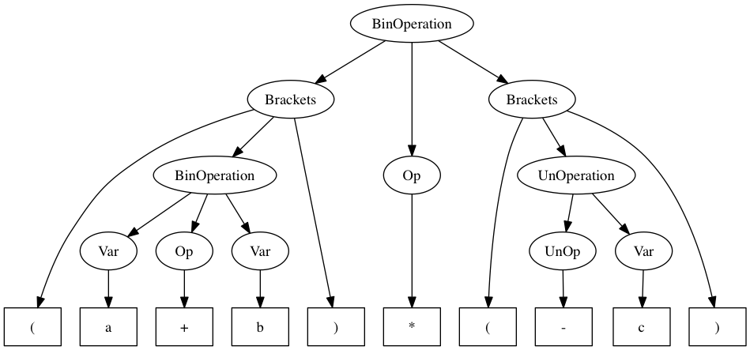

# ContextFree

ContextFree is a parser for languages generated by context free grammars written in Swift.

For a given set of productions (in Chomsky normal form) the parser is able to 
produce a syntax tree for a word contained in the language
or to pinpoint syntax errors, if the word is not contained in the language.

## Example

The following code creates a grammar which can be used to parse arithmetic expressions.
`n(...)` creates a non terminal character, `t(...)` creates a terminal character.

```swift
let expression = "Expr" -->
	n("Expr") <+> n("BinOp") <+> n("Expr")
	<|> t("(") <+> n("Expr") <+> t(")")
	<|> n("UnOp") <+> n("Expr")
	<|> n("Num")
	<|> n("Var")

let BinOp = "BinOp" --> t("+") <|> t("-") <|> t("*") <|> t("/")
let UnOp = "UnOp" --> t("+") <|> t("-")
let Num = try! "Num" --> rt("\\b\\d+(\\.\\d+)?\\b")
let Var = try! "Var" --> rt("\\b[a-zA-Z_][a-zA-Z0-9_]*\\b")

let grammar = Grammar(productions: expression + BinOp + UnOp + [Num, Var], start: "Expr")
```

This grammar can then be used to check if an arithmetic expression is valid.

In a valid expression, all parentheses are closed again and 
binary operators always have a left side and a right side operand.

A syntax tree can be generated, which describes the structure of a given word:

 ```swift
 let syntaxTree = try grammar.generateSyntaxTree(for: "(a+b)*(-c)")
 ```


